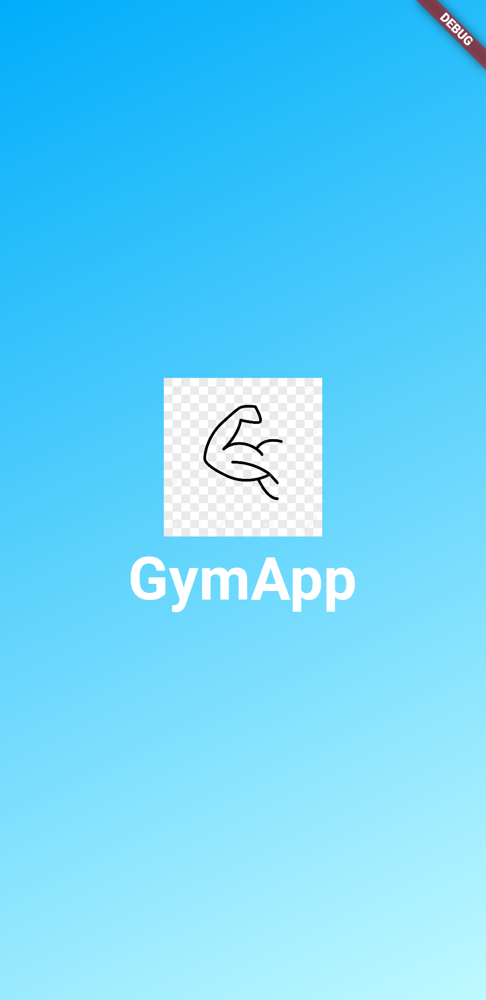
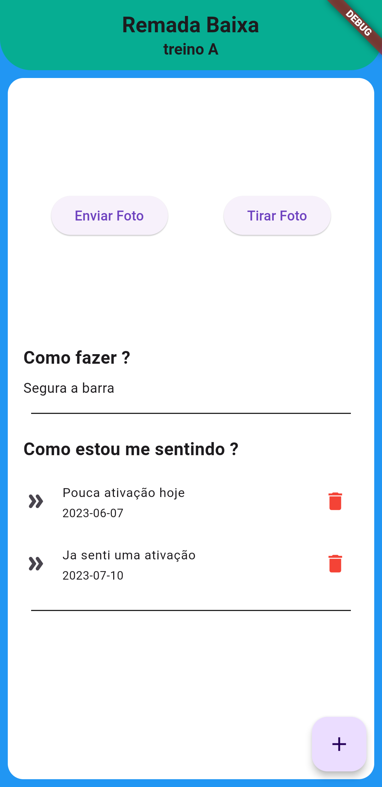

# My Dart Project

Welcome to my Dart project! This project is intended for...

## How to Run the Project

Follow these steps to run the project on your local machine:

1. Clone this repository:

https://github.com/GustavoAlex10/Flutter-study.git

2. Navigate to the project directory:

3. Run the project:

## Screenshots

Here are some screenshots of the project in action:

Screenshot 1:

Screenshot 2: 

## Contribution

If you would like to contribute to this project, follow the steps below:

1. Fork this repository.
2. Create a branch for your new feature: `git checkout -b my-new-feature`
3. Make desired changes and add commits: `git commit -m 'Add my new feature'`
4. Push the changes to your fork: `git push origin my-new-feature`
5. Open a pull request in this repository, describing your changes.

## License

This project is licensed under the [MIT License](LICENSE).
